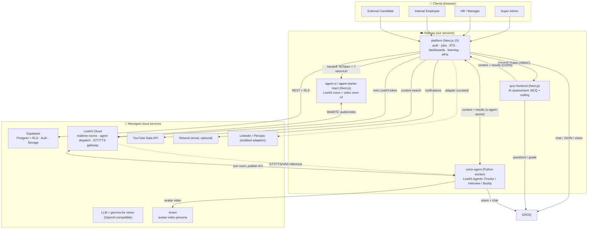
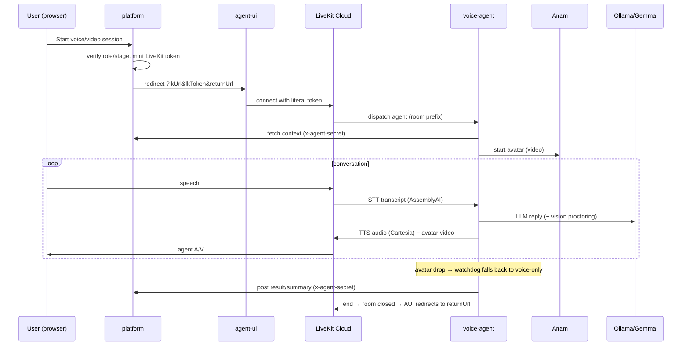
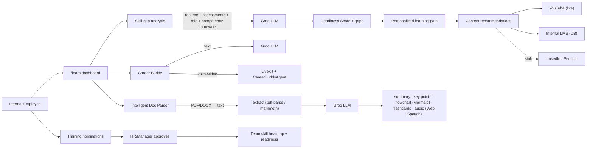
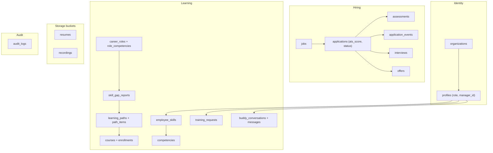
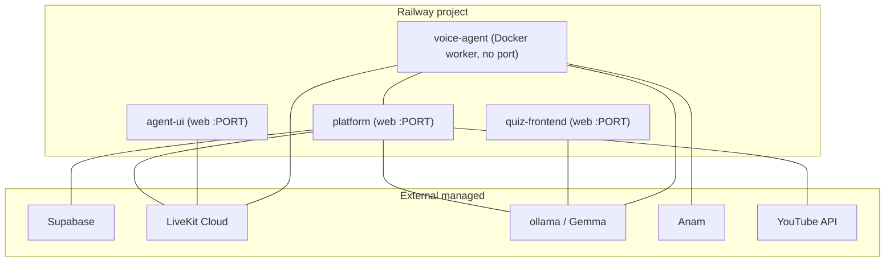

# Qore AI — End-to-End Architecture

AI-powered **Hiring** + **Learning & Career Buddy** platform. Four deployable
services on Railway, backed by Supabase, LiveKit Cloud, Groq, Anam, and YouTube.

---

## 1. System overview (components, cloud services, AI)



**Legend:** solid = request/data flow, dotted = inference/optional/stubbed.

---

## 2. AI models, agents & APIs

| Capability | Model / Service | Where it runs | Used for |
|---|---|---|---|
| Text LLM | **Ollama** | platform, quiz, voice-agent | ATS scoring, resume parse, quiz gen, grading, skill-gap, learning path, Career Buddy text, doc-parser transforms, interview scoring |
| Vision LLM | **Gemma** | voice-agent | Screen monitoring (tab-switch), webcam proctoring (faces/gaze/phone) |
| Speech-to-Text | **AssemblyAI `universal-streaming`** (via LiveKit inference) | LiveKit | Candidate/employee speech in interviews & Buddy |
| Text-to-Speech | **Cartesia `sonic-3`** (via LiveKit inference) | LiveKit | Agent voice |
| Voice activity / turns | **Silero VAD** + LiveKit **MultilingualModel** | voice-agent | Turn detection |
| Avatar video | **Anam** persona | voice-agent → LiveKit | Video coaching / interviewer face |
| Learning content | **YouTube Data API** (live) + LinkedIn/Percipio (stub) + internal LMS (DB) | platform | Course recommendations |
| In-browser narration | **Web Speech API** | client | Doc-parser "audio" output |
| Diagram render | **Mermaid** | client | Doc-parser "flowchart" output |

**LiveKit agents (Python, dispatched by room-name prefix):**

| Agent | Room prefix | Responsibility |
|---|---|---|
| `ProctorAgent` | `assessment_<appId>` | Screen + webcam proctoring during the quiz; reports integrity + violations |
| `InterviewAgent` | `interview_<appId>` | JD-driven voice/video interview → scores + hire recommendation |
| `CareerBuddyAgent` | `buddy_<employeeId>` | Voice/video career coaching grounded in learning context |

---

## 3. Hiring pipeline — data flow

```mermaid
sequenceDiagram
  participant C as Candidate (browser)
  participant PF as platform
  participant SB as Supabase
  participant G as Ollama/Gemma
  participant QF as quiz-frontend
  participant VA as voice-agent
  participant LK as LiveKit

  C->>PF: Apply + upload resume
  PF->>SB: store resume (Storage) + application (DB)
  PF->>G: parse resume + ATS score vs JD
  G-->>PF: ats_score + breakdown + reasoning
  PF->>SB: update application - gate on ATS threshold ;
  Note over PF: pass → assessment_assigned · fail → ats_rejected

  C->>PF: Start assessment (identity check)
  PF->>QF: redirect ?token=HMAC&platform
  QF->>PF: GET /api/assessment/context (token)
  QF->>G: generate JD questions + grade coding
  Note over C,QF: ProctorAgent watches via LiveKit room
  QF->>PF: POST /api/assessment/result (token)
  PF->>SB: assessment score; pass/fail vs test threshold

  C->>PF: Start AI interview
  PF->>LK: mint token (room interview_<id>)
  PF->>C: redirect to agent-ui ?lkToken
  C<<->>LK: WebRTC A/V
  VA->>LK: dispatched to interview_ room
  VA->>PF: GET /api/agent/context
  VA->>PF: POST /api/agent/result (score + recommend)
  PF->>SB: decision → hr_review or rejected
```

---

## 4. Realtime voice/video (interview & Career Buddy)



---

## 5. Learning & Career Buddy module



---

## 6. Data model (Supabase Postgres, grouped)



All tables enforce **Row Level Security**: owners read/write their own rows;
`is_hr()` / `is_super_admin()` widen access; trusted server writes use the
**service-role** key.

---

## 7. Deployment topology (Railway)



- 3 Next.js apps build with Nixpacks; voice-agent builds from its **Dockerfile**.
- Cross-service URLs are wired via env (`NEXT_PUBLIC_APP_URL`, `NEXT_PUBLIC_QUIZ_URL`,
  `NEXT_PUBLIC_AGENT_UI_URL`, `PLATFORM_URL`). See [DEPLOY.md](DEPLOY.md).

---

## 8. Security & trust boundaries

| Boundary | Mechanism |
|---|---|
| Browser ↔ DB | Supabase **RLS** (anon key); never the service role |
| Trusted server writes (ATS, results) | Supabase **service-role** key (server-only) |
| platform ↔ quiz-frontend | short-lived **HMAC assessment token** binds session to an application |
| platform ↔ voice-agent | **`AGENT_SHARED_SECRET`** header (server-to-server) |
| LiveKit room access | platform-minted **JWT**, gated by role + application stage |
| Cross-origin assessment APIs | **CORS** locked to the quiz origin |

---

## 9. Tech stack summary

- **Frontend:** Next.js 15 (App Router, React 19), TypeScript, custom dark design system, Mermaid.
- **Backend:** Next.js Route Handlers + Server Actions; Supabase Postgres/Auth/Storage.
- **Realtime:** LiveKit Cloud + LiveKit Agents (Python, `uv`).
- **AI:** Groq (text + vision), AssemblyAI STT, Cartesia TTS, Silero VAD, Anam avatar.
- **Docs/parsing:** pdf-parse, mammoth.
- **Infra:** Railway (4 services), Docker (worker).
```
